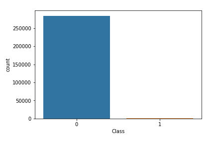

# Imbalanced Classes in Machine Learning

## Summary

In reality there are 2 cases of imbalanced datasets. The first is that the data we have collected is not representative of the population we are sampling from. If this happens to be the case, there is only 1 real solution, which is to collect more representative data.

The second case is when the imbalanced dataset is a cause of our business problem. For example, such problems as fraud detection, or medical diagnosis. In reality, the case of fraudulent to non-fraudulent, or cancerous to non-cancerous occur at a highly disproportionate ratios.

Machine learning models performs best on balanced datasets. We will explore some methods and techniques to work around imbalanced datasets and optimize our models. Techniques such as:
  - Undersampling
  - Oversampling
  - Synthetic Minority Oversampling Technique
  - Anomaly Detection Algorithms

It is also important to use to correct metrics to evaluate the performance of your model when working with imbalanced classes. The standard accuracy metric is not an effective metric as the goal is to identify the minority class. The most effective metrics when evaluating imbalanced classes are the precision, recall, and F1-Score.

## Undersampling

Undersampling is a method used to decrease the instances of the majority class by sampling from the majority class. In undersampling, we would remove samples from the over-represented class.

When using undersampling, we risk leaving out important instances and losing significant information about the differences between the two classes. We are prone to underfitting the data. Undersampling should only be used if we are working with a huge dataset.


## Oversampling

Oversampling is a method used to increase the instances of the minority class by creating duplicate instances of the minority class or by taking the majority class in folds and reusing the minority classes with each fold of the majority class. In oversampling, we would create more instances of the minority class to closely match the instances of the majority class.

When using oversampling, we risk overfitting the model as we introduce duplicate instances of the minority class, which is already a small pool to begin with. We would only use this if we are working with a small dataset.

## SMOTE

Synthetic Minority Oversampling Technique (SMOTE) as the name suggests creates new instances of the minority class by forming combinations of neighboring instances. This is an improved method over the oversampling method discussed as it creates new points rather than using duplicates. This reduces the risk of overfitting.

## Anomaly Detection

There are machine learning algorithms which specializes in detecting anomalies. They work by assuming that the data is normally distributed and anything that deviates largely from the normal distribution (majority class) is classified as an anomaly (minority class). Some of these algorithms include SVMs, Clustering methods, and Isolation Forests.

## Credit Card Fraud Example

Using a credit card dataset from kaggle we will look at methods of working with imbalanced classes. The distribution of the classes in the dataset is as follows, 492 classifications as fraudulent transactions and 284315 classifications as non-fraudulent transactions. There is only 0.17% of transactions being classified as fraudulent, meaning that if we had a model that predicted non-fraudulent for every transaction, we would still get an accuracy of 99.83%.

```Python
## Loading Dataset
df = pd.read_csv('./datasets/creditcard.csv')
## Distribution plot of classes
sns.countplot(df['Class'])
## Percentage of fraudulent transactions
len(df[df['Class']==1])/len(df[df['Class']==0]) * 100
```

Output:



For imbalanced classification problems, we would use either use precision or recall as the performance metric. For anomaly detection problems, we would put heavier emphasis on False Negatives than False Positives. Meaning we would prefer to misclassify a non-fraudulent transaction as fraudulent than misclassify a fraudulent transaction as non-fraudulent.

Building a quick logistic regression model on our dataset, we get a recall score of 60.2%. Using some of the imbalance classification methods we are going to try and improve that score.

```Python
from sklearn.model_selection import train_test_split
from sklearn.linear_model import LogisticRegression
from sklearn.metrics import accuracy_score, confusion_matrix, recall_score

y = df.iloc[:,-1].values
X = df.iloc[:,:-1].values
X_train, X_test, y_train, y_test = train_test_split(X, y, test_size=0.2, random_state=0, stratify=y)

lr = LogisticRegression(solver='liblinear').fit(X_train, y_train)
y_pred = lr.predict(X_test)
print(recall_score(y_test, y_pred))
```

###### Oversampling

```Python
from sklearn.utils import resample

## Preprocess Dataset for oversampling
data = np.append(arr=X_train, values=y_train.reshape(len(y_train),1), axis=1)
new_df = pd.DataFrame(data, columns=df.columns)
fraud = new_df[new_df['Class']==1]
not_fraud = new_df[new_df['Class']==0]

## Oversampling instances of Fraudulent transactions to equal the number of non-fraudulent transactions
oversampling = resample(fraud, replace=True, n_samples=len(not_fraud), random_state = 0)
oversampled_dataset = pd.concat([not_fraud, oversampling])
oversampled_dataset['Class'].value_counts()

## Retraining the logistic regression model with the new oversampled dataset
X_train = oversampled_dataset.iloc[:,:-1]
y_train = oversampled_dataset.iloc[:,-1]
oversampled_lr = LogisticRegression(solver='liblinear').fit(X_train, y_train)
y_pred_os = oversampled_lr.predict(X_test)
print(recall_score(y_test, y_pred_os))
```

From oversampling the minority class to equal the number of instances of the majority class, we can already see an improved recall score of 86.7%.

###### Undersampling

```Python
## Undersampling instances of non-Fraudulent transactions to equal the number of fraudulent transactions
undersampling = resample(not_fraud, replace=True, n_samples=len(fraud), random_state=0)
undersampled_dataset = pd.concat([fraud, undersampling])
undersampled_dataset['Class'].value_counts()

## Retraining the logistic regression model with the new undersampled dataset
X_train_us = undersampled_dataset.iloc[:,:-1]
y_train_us = undersampled_dataset.iloc[:,-1]
undersampled_lr = LogisticRegression(solver='liblinear').fit(X_train_us, y_train_us)
y_pred_us = undersampled_lr.predict(X_test)
print(recall_score(y_test, y_pred_us))
```

From undersampling the majority class to equal the number of instances of the minority class, we can already see an improved recall score of 87.8%.

###### SMOTE

```Python
## Import library from imblearn
from imblearn.over_sampling import SMOTE

## Retraining the logistic regression model with the new SMOTE dataset
sm = SMOTE(random_state=0, ratio=1.0)
X_train_sm, y_train_sm = sm.fit_sample(X_train, y_train)
smote_lr = LogisticRegression(solver='liblinear').fit(X_train_sm, y_train_sm)
y_pred_sm = smote_lr.predict(X_test)
print(recall_score(y_test, y_pred_sm))
```

Using SMOTE we get the same performance as the oversampling example with a recall score of 86.7%.

###### Anomaly Detection Algorithm: One Class SVM

```Python
## Import Library from scikit-learn
from sklearn.svm import OneClassSVM

## Feature Scaling
from sklearn.preprocessing import StandardScaler
sc_X = StandardScaler()
X_train = sc_X.fit_transform(X_train)
X_test = sc_X.transform(X_test)

## Training the One Class SVM model
svm = OneClassSVM()
svm.fit(X_train, y_train)
y_pred_svm = svm.predict(X_test)
print(recall_score(y_test, y_pred_svm))
```

The One Class SVM yields a recall score of 62.2%, which is slightly better logistic regression but underperforms compared to the resampling methods.

## Conclusion

We can see that by resampling our imbalanced dataset or by using a more compatible algorithm, we can improve the performance of our machine learning model even without having to do feature selection or hyperparameter tuning.
